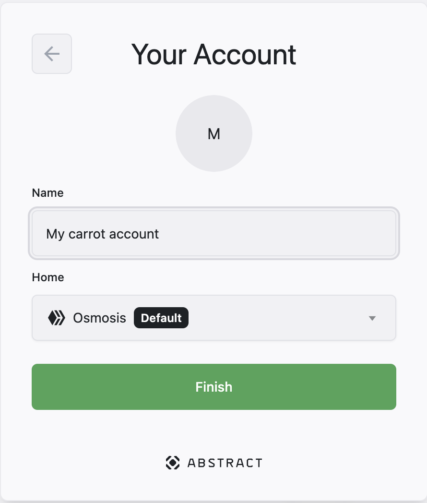
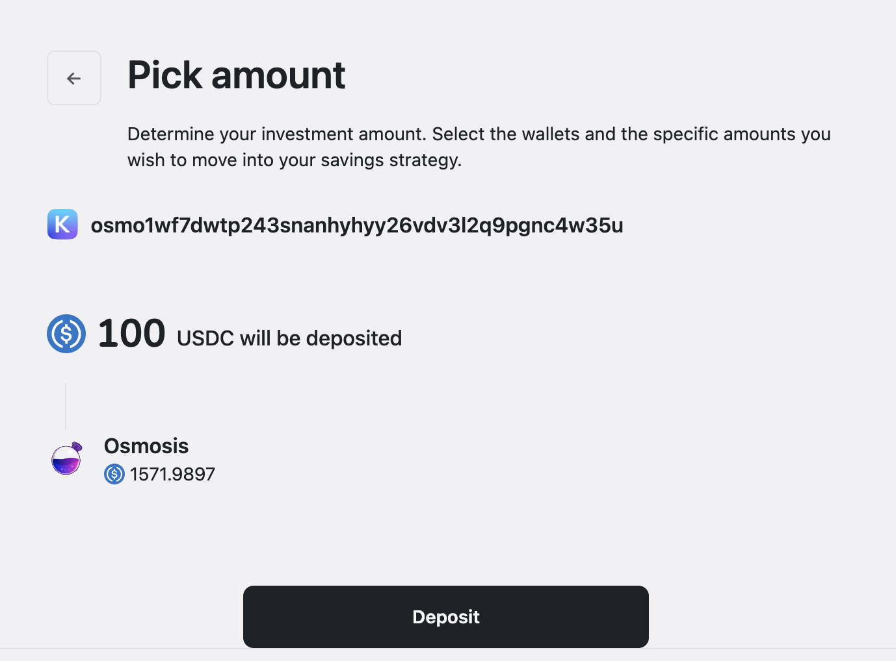
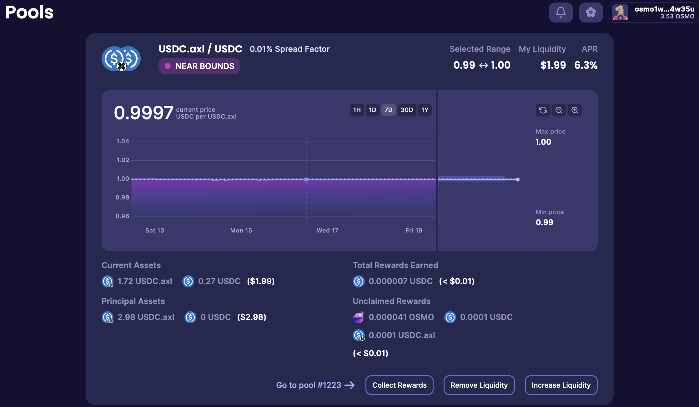
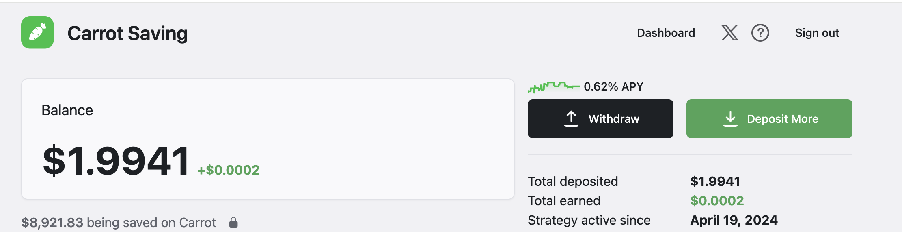
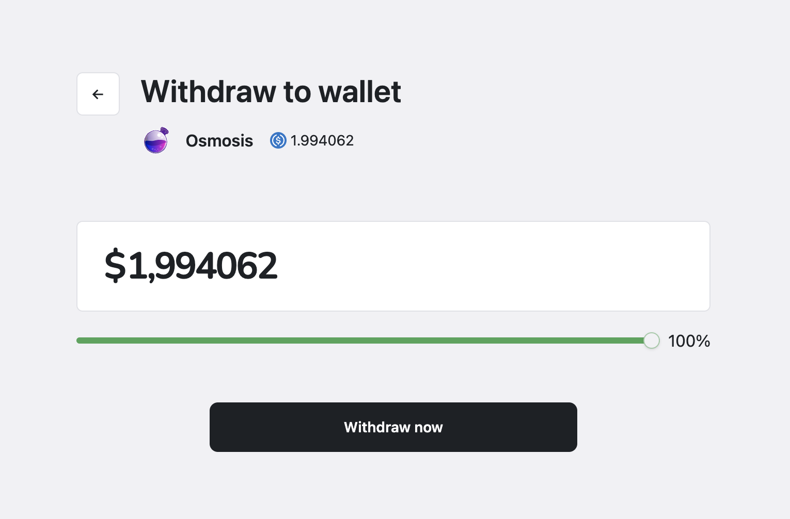
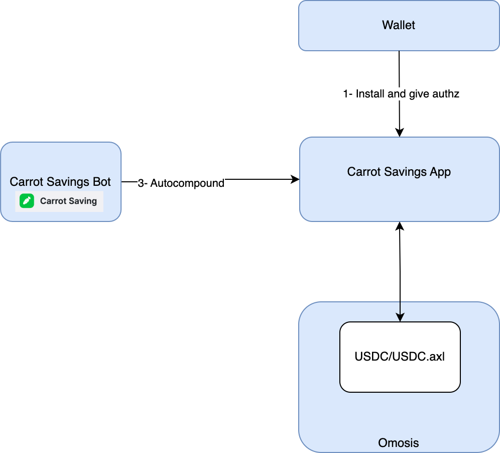

# How it works

## Version 1

The first version of Carrot Savings utilizes a single strategy: managing USDC (USDC - Noble) / USDC (USDC.axl) liquidity on Osmosis.

Here's the process:

1. Installation: The user installs the Carrot Savings App on their Abstract account
   .

---

2. Deposit & Authorization: The user deposits some USDC into the app and grants it authorization rights. These rights allow the app to perform specific actions on their behalf, like swapping tokens or creating liquidity pools.
   

---

3. Strategy Execution: The app swaps the deposited USDC (Noble) for the optimal ratio of USDC (USDC) / USDC.axl. Then, it creates a liquidity position on behalf of the user on Osmosis.
   

---

4. Autocompounding: Since autocompounding is permissionless, the Carrot Savings team manages a bot that automatically compounds the yield generated for all users.
   

---

5. Funds withdrawal: The user can withdraw anytime their funds from the liquidity pool on Osmosis back to their account.
   

---

## Diagram

